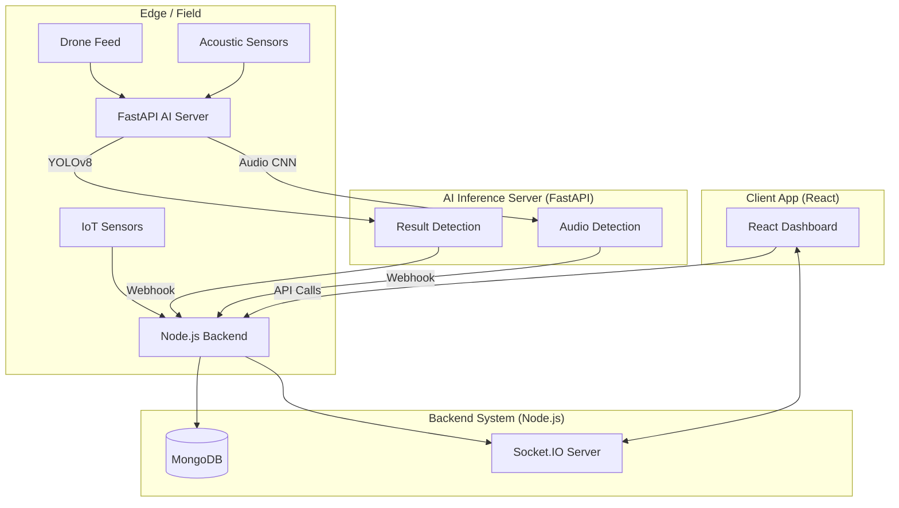

# System Architecture - ForestGuard AI

## 1. High-Level Overview
The system follows a microservices-inspired architecture with a dedicated AI inference server.

## 2. AI Processing Pipeline
1.  **Data Acquisition**: Frames from drone video or packets from IoT sensors are ingested.
2.  **Preprocessing**: Resizing, normalization, and noise reduction (for audio).
3.  **Inference**:
    - **Vision**: YOLOv8 detects humans, chainsaws, and trucks.
    - **Audio**: Librosa extracts spectrograms; a CNN classifies chainsaw frequency patterns.
4.  **Thresholding**: Only detections with confidence > 0.7 trigger alerts.
5.  **Dispatch**: Alert payload (type, timestamp, dummy GPS) sent to main backend.

## 3. Deployment Flow
- **Frontend**: CI/CD to Vercel/Netlify.
- **Backend**: Dockerized container on AWS EC2 or Render.
- **AI Server**: High-CPU/GPU instance (AWS G-series or local server with Nvidia GPU).
